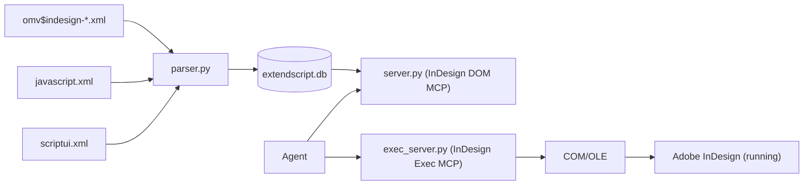

# InDesign Scripting MCP (DOM + Exec)

<div align="center">
  
  <br>
  <em>Done with a single prompt from within Claude Desktop in 20 seconds (and some tinkering afterwards).</em>
</div>

<br>

Two MCP servers for Adobe InDesign:

- **InDesign DOM MCP** (`server.py`): query InDesign DOM + ExtendScript JavaScript Core + ScriptUI classes from a local SQLite database built from XML sources.
- **InDesign Exec MCP** (`exec_server.py`): execute ExtendScript (JSX) in a running InDesign instance via Windows COM/OLE and return structured JSON results.

## What This Is

This project exposes two complementary servers to agents:

- **DOM server**: fast, read-only access to the object model without loading the entire DOM into the model context.
- **Exec server**: safe JSX execution with undo grouping and DOM-safe JSON serialization.

## How This Differs from UXP-based Approaches

| Aspect | This project | UXP-based MCP |
|---|---|---|
| Scripting engine | ExtendScript (ES3) | UXP (modern JavaScript) |
| JSON | Polyfill required (`json_polyfill.jsx`) | Native |
| Communication | Windows COM/OLE (synchronous, blocking) | Plugin bridge layer |
| Setup | Zero-setup: start InDesign, run MCP | Requires UXP plugin install |
| Future | ExtendScript is being phased out by Adobe | Adobe's strategic direction |

## Architecture



Core files:

- `server.py`: MCP tools for querying the DOM database
- `exec_server.py`: MCP tools for JSX execution in InDesign
- `parser.py`: OMV XML parser + database builder (SQLite + FTS5)
- `db.py`: database query layer for DOM tools
- `manage.py`: CLI to analyze/build/update/validate the database
- `indesign_com.py`: COM/OLE automation layer + safe JSX wrapper
- `json_polyfill.jsx`: ExtendScript JSON polyfill + `__safeStringify()` (DOM-safe)
- `gotchas.json`: curated gotchas and best-practice knowledge base (community growth via PRs)

## MCP Tools Reference

### InDesign DOM MCP (`server.py`)

- `lookup_class(name, source?)`
- `get_properties(class_name, source?, filter?, include_inherited?)`
- `get_methods(class_name, source?, filter?, include_inherited?)`
- `get_method_detail(class_name, method_name, source?)`
- `get_enum_values(enum_name, source?)`
- `get_hierarchy(class_name, source?)`
- `search_dom(query, source?)`
- `list_classes(suite?, type=all, source?)`
- `dom_info()`
- `list_sources()`
- `knowledge_overview()`

### InDesign Exec MCP (`exec_server.py`)

- `run_jsx(code, undo_name="Agent Script", undo_mode="entire")`
- `get_document_info()`
- `get_selection(detail_level="basic"|"full")`
- `eval_expression(expression)`
- `undo(steps=1)`
- `report_learning(problem, solution, triggers, category?, severity?, error_message?, jsx_context?)`
- `get_gotchas(context?)`
- `get_quick_reference()`

## Agentic Usage / Key Patterns

### 1) Knowledge overview -> lookup -> code generation -> execution

1. Use DOM MCP to look up the correct class/method signature.
2. For ambiguous class names (`Window`, `Group`, `Panel`, `Event`) pass `source="dom"` or `source="scriptui"`.
3. For ExtendScript-specific APIs (`UnitValue`, `$`, `File`, `Folder`, `Socket`, `XML`, `XMLList`) use `source="javascript"`.
4. Write JSX that assigns a plain value to `__result` (do not `return`).
5. Execute with `run_jsx` and verify with `eval_expression` or `get_document_info`.
6. If needed, rollback with `undo`.

### 2) Recommended agent boot sequence

1. `knowledge_overview()`
2. `list_sources()`
3. `search_dom(query, source=...)`
4. `lookup_class(...)` / `get_method_detail(...)`
5. `indesign-exec` tools (`run_jsx`, `eval_expression`, `undo`)

### 3) ScriptUI positioning

ScriptUI remains documented for legacy scripts and small dialogs. For new UI-heavy development, prefer a modern UXP plugin.

### 4) `__result` convention

The wrapper serializes `__result` to JSON. Example:

```jsx
var doc = app.activeDocument;
__result = { name: doc.name, pages: doc.pages.length };
```

### 5) Undo grouping

Use `undo_mode="entire"` and a descriptive `undo_name` so one Ctrl+Z reverts the whole operation.

### 6) JSON polyfill / safe serialization

ExtendScript engines can lack `JSON.stringify` or crash when traversing DOM objects.
This project always provides `__safeStringify()` (and installs `JSON.stringify` if missing).

## Data Sources

The parser supports three XML sources:

- InDesign DOM OMV XML (`omv$indesign-*.xml`)
- ExtendScript JavaScript Core (`javascript.xml`)
- ScriptUI (`scriptui.xml`)

Common source locations:

- macOS:
  - `/Library/Application Support/Adobe/Scripting Dictionaries CC/CommonFiles`
  - `~/Library/Preferences/ExtendScript Toolkit/4.0/omv$indesign-9.064$9.0.xml`
- Windows:
  - `\\Users\\[Username]\\AppData\\Roaming\\Adobe\\ExtendScript Toolkit\\4.0\\omv$indesign-10.064$10.0.xml`
  - `C:\\Program Files (x86)\\Common Files\\Adobe\\Scripting Dictionaries CC\\CommonFiles`

## Build Commands

### Build all sources (recommended)

```bash
python manage.py build-all --dom "C:\\path\\to\\omv$indesign-21.064$21.0.xml" --js "C:\\path\\to\\javascript.xml" --sui "C:\\path\\to\\scriptui.xml"
```

### Build single source

```bash
python manage.py build --source dom --xml "C:\\path\\to\\omv$indesign-21.064$21.0.xml"
```

### Validate source coverage

```bash
python manage.py validate --expect-sources dom,javascript,scriptui
```
2. Write JSX that assigns a plain value to `__result` (do not `return`).
3. Execute with `run_jsx` and verify with `eval_expression` or `get_document_info`.
4. If needed, rollback with `undo`.

## Prerequisites

- Windows (Exec server uses COM/OLE)
- Adobe InDesign Desktop (running)
- Python 3.11+
- `uv` (recommended) or `pip`
- OMV XML from the ExtendScript Toolkit cache, e.g.:
  - Windows: `%APPDATA%\\Adobe\\ExtendScript Toolkit\\4.0\\omv$indesign-*.xml`

## Installation

### 1) Create/update the DOM database

```bash
python manage.py build-all --dom "C:\\path\\to\\omv$indesign-21.064$21.0.xml" --js "C:\\path\\to\\javascript.xml" --sui "C:\\path\\to\\scriptui.xml"
```

The resulting `extendscript.db` is generated locally and should not be committed.

### 2) Run the MCP servers (stdio transport)

With `uv`:

```bash
uv run server.py
uv run exec_server.py
```

With `pip` / plain Python:

```bash
python server.py
python exec_server.py
```

## MCP Client Configuration

### Cursor

Add two servers that run from this repo directory (use stdio transport):

```json
{
  "mcpServers": {
    "indesign-dom": {
      "command": "uv",
      "args": ["run", "server.py"],
      "cwd": "D:\\\\path\\\\to\\\\indesign_scripting_MCP"
    },
    "indesign-exec": {
      "command": "uv",
      "args": ["run", "exec_server.py"],
      "cwd": "D:\\\\path\\\\to\\\\indesign_scripting_MCP"
    }
  }
}
```

### Claude Desktop

Add the same server definitions to `claude_desktop_config.json` (the exact file location depends on your OS install).

## Updating the Database

To update one source:

```bash
python manage.py update --source dom --xml "C:\\path\\to\\omv$indesign-22.064$22.0.xml"
```

To rebuild all three sources:

```bash
python manage.py build-all --dom "C:\\path\\to\\omv$indesign-22.064$22.0.xml" --js "C:\\path\\to\\javascript.xml" --sui "C:\\path\\to\\scriptui.xml"
```

## Contributing Gotchas

The gotchas system is a shared debugging memory for this MCP:

- `gotchas.json` is the curated, versioned knowledge base committed to Git.
- Entries describe recurring pitfalls, fixes, and trigger keywords for context matching.
- Agents will query relevant items with `get_gotchas(context, min_severity?, top_n?)` before writing JSX.
- `get_quick_reference()` includes static guidance and appends community gotchas at runtime.
- During troubleshooting, agents can and will submit newly resolved issues via `report_learning(...)` to your MCP.

Please commit them as PR to this repo for all to benefit! It keeps successful debugging outcomes reusable across future sessions and across users.

Two contribution paths are supported:

### A) Direct curated updates via GitHub PR
1. Fork + clone this repository
2. Edit `gotchas.json` and add a new entry
3. Open a PR with the new gotcha
4. Maintainer review and merge

### B) Agent submission -> maintainer review
1. Your agent calls `report_learning(...)`
2. Entry is written to `submissions/pending.jsonl` (local queue, not committed)
3. Maintainer (you) runs:

```bash
python manage.py review-submissions
```

4. Approved entries are promoted to `gotchas.json`
5. Commit and open a PR to share the curated learning

## License

MIT. See `LICENSE`.

## Third-Party Notices

This repository references safety/serialization patterns inspired by IdExtenso (Marc Autret, MIT).
See `THIRD_PARTY_NOTICES.md`.

## Acknowledgements

- Gregor Fellenz: `https://github.com/grefel/extendscriptApiDocTransformations`
- This project adopts conceptual learnings from that repository:
  - XML merge strategy across InDesign DOM + JavaScript + ScriptUI
  - namespace normalization before parsing
  - explicit handling of ScriptUI naming collisions
  - reference-aware transformation mindset
