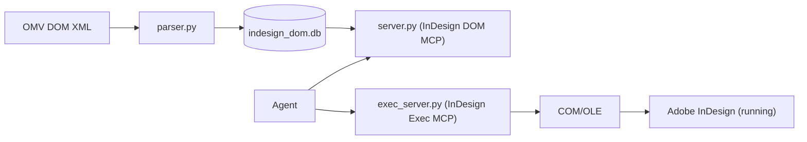

# InDesign Scripting MCP (DOM + Exec)

<div align="center">
  
  <br>
  <em>Done with a single prompt from within Claude Desktop in 20 seconds.</em>
</div>

<br>

Two MCP servers for Adobe InDesign:

- **InDesign DOM MCP** (`server.py`): query the complete InDesign ExtendScript Object Model (classes, properties, methods, enums, inheritance) from a local SQLite database built from the OMV XML.
- **InDesign Exec MCP** (`exec_server.py`): execute ExtendScript (JSX) in a running InDesign instance via Windows COM/OLE and return structured JSON results.

## What This Is

This project exposes two complementary servers to agents:

- **DOM server**: fast, read-only access to the object model without loading the entire DOM into the model context.
- **Exec server**: safe JSX execution with undo grouping and DOM-safe JSON serialization.

## How This Differs from UXP-based Approaches

| Aspect | This project | UXP-based MCP |
|---|---|---|
| Scripting engine | ExtendScript (ES3) | UXP (modern JavaScript) |
| JSON | Polyfill required (`json_polyfill.jsx`) | Native |
| Communication | Windows COM/OLE (synchronous, blocking) | Plugin bridge layer |
| Setup | Zero-setup: start InDesign, run MCP | Requires UXP plugin install |
| Future | ExtendScript is being phased out by Adobe | Adobe's strategic direction |

## Architecture



Core files:

- `server.py`: MCP tools for querying the DOM database
- `exec_server.py`: MCP tools for JSX execution in InDesign
- `parser.py`: OMV XML parser + database builder (SQLite + FTS5)
- `db.py`: database query layer for DOM tools
- `manage.py`: CLI to analyze/build/update/validate the database
- `indesign_com.py`: COM/OLE automation layer + safe JSX wrapper
- `json_polyfill.jsx`: ExtendScript JSON polyfill + `__safeStringify()` (DOM-safe)

## MCP Tools Reference

### InDesign DOM MCP (`server.py`)

- `lookup_class(name)`
- `get_properties(class_name, filter?, include_inherited?)`
- `get_methods(class_name, filter?, include_inherited?)`
- `get_method_detail(class_name, method_name)`
- `get_enum_values(enum_name)`
- `get_hierarchy(class_name)`
- `search_dom(query)`
- `list_classes(suite?, type=all)`
- `dom_info()`

### InDesign Exec MCP (`exec_server.py`)

- `run_jsx(code, undo_name="Agent Script", undo_mode="entire")`
- `get_document_info()`
- `get_selection(detail_level="basic"|"full")`
- `eval_expression(expression)`
- `undo(steps=1)`

## Agentic Usage / Key Patterns

### 1) DOM lookup → code generation → execution

1. Use DOM MCP to look up the correct class/method signature.
2. Write JSX that assigns a plain value to `__result` (do not `return`).
3. Execute with `run_jsx` and verify with `eval_expression` or `get_document_info`.
4. If needed, rollback with `undo`.

### 2) `__result` convention

The wrapper serializes `__result` to JSON. Example:

```jsx
var doc = app.activeDocument;
__result = { name: doc.name, pages: doc.pages.length };
```

### 3) Undo grouping

Use `undo_mode="entire"` and a descriptive `undo_name` so one Ctrl+Z reverts the whole operation.

### 4) JSON polyfill / safe serialization

ExtendScript engines can lack `JSON.stringify` or crash when traversing DOM objects.
This project always provides `__safeStringify()` (and installs `JSON.stringify` if missing).

## Prerequisites

- Windows (Exec server uses COM/OLE)
- Adobe InDesign Desktop (running)
- Python 3.11+
- `uv` (recommended) or `pip`
- OMV XML from the ExtendScript Toolkit cache, e.g.:
  - Windows: `%APPDATA%\\Adobe\\ExtendScript Toolkit\\4.0\\omv$indesign-*.xml`

## Installation

### 1) Create/update the DOM database

```bash
python manage.py build --xml "C:\\path\\to\\omv$indesign-21.064$21.0.xml"
```

The resulting `indesign_dom.db` is generated locally and should not be committed.

### 2) Run the MCP servers (stdio transport)

With `uv`:

```bash
uv run server.py
uv run exec_server.py
```

With `pip` / plain Python:

```bash
python server.py
python exec_server.py
```

## MCP Client Configuration

### Cursor

Add two servers that run from this repo directory (use stdio transport):

```json
{
  "mcpServers": {
    "indesign-dom": {
      "command": "uv",
      "args": ["run", "server.py"],
      "cwd": "D:\\\\path\\\\to\\\\indesign_scripting_MCP"
    },
    "indesign-exec": {
      "command": "uv",
      "args": ["run", "exec_server.py"],
      "cwd": "D:\\\\path\\\\to\\\\indesign_scripting_MCP"
    }
  }
}
```

### Claude Desktop

Add the same server definitions to `claude_desktop_config.json` (the exact file location depends on your OS install).

## Updating the DOM Database from the Adobe ESTK Object Model Viewer XML-Source

Find the latest OMV DOM xml file for your latest Indesign Version, then 

```bash
python manage.py update --xml "C:\\path\\to\\omv$indesign-22.064$22.0.xml"
```

## License

MIT. See `LICENSE`.

## Third-Party Notices

This repository references safety/serialization patterns inspired by IdExtenso (Marc Autret, MIT).
See `THIRD_PARTY_NOTICES.md`.

